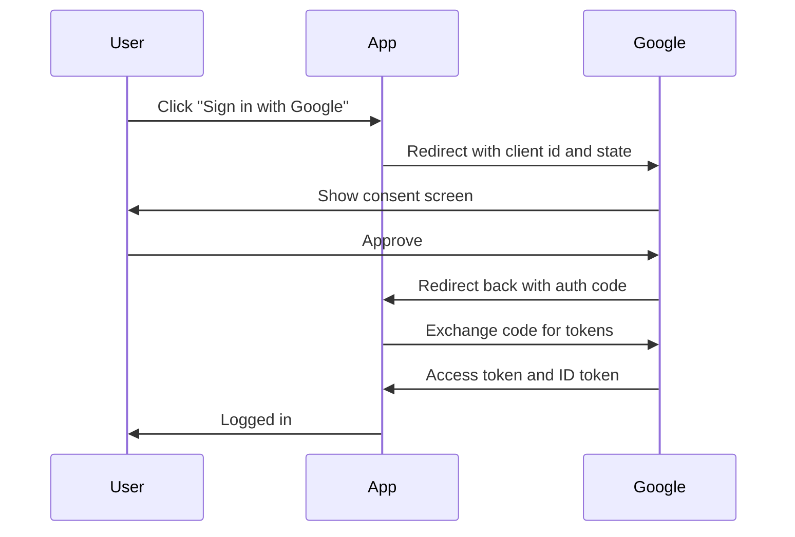

Here's the login flow from our design doc:

```mermaid
sequenceDiagram
    User->>App: Click "Sign in with Google"
    App->>Google: Redirect with client id and state
    Google->>User: Show consent screen
    User->>Google: Approve
    Google->>App: Redirect back with auth code
    App->>Google: Exchange code for tokens
    Google->>App: Access token and ID token
    App->>User: Logged in
```

Can you turn this into a polished diagram as an HTML page? It should look good in dark mode too.
