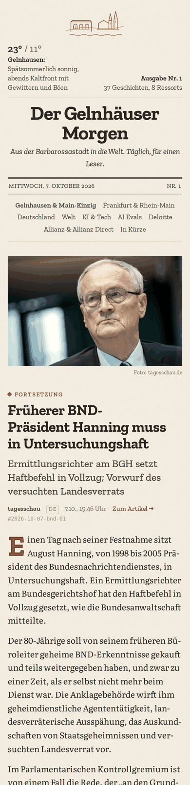
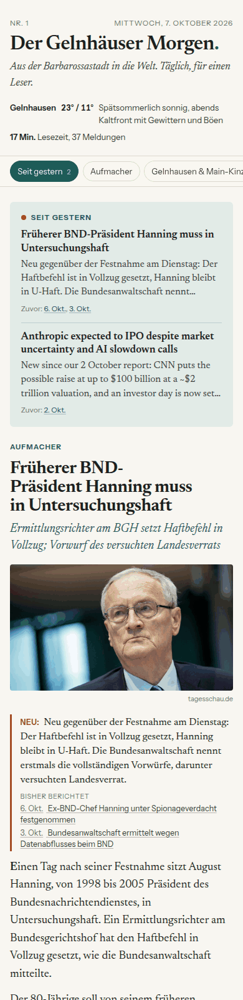
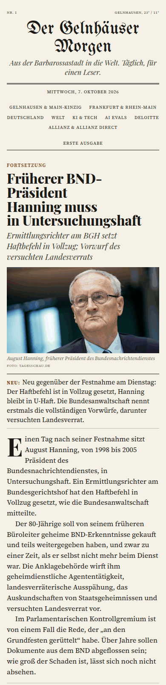
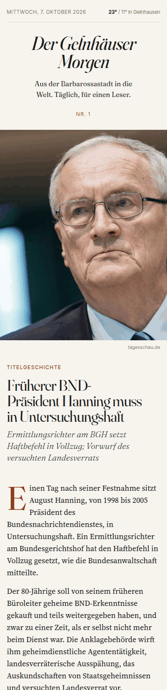
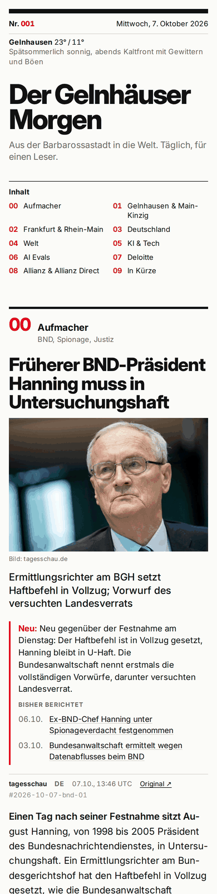

# News

A personal daily newspaper, built every morning as one self-contained HTML page
in a kasten vault and linked from that day's
daily note. Each story stays in its source language. Stories earlier editions
ran come back only when something new happened, as a follow-up that links the
earlier coverage.

## Skills

- `/news:edition [--vault PATH] [--date YYYY-MM-DD]`: applies open feedback,
  gathers news per section (one subagent each where the host has them), drops
  repeats, writes, renders with the configured design, records what ran, and
  links the page from the daily note. Runs by hand or headless from cron.
- `/news:feedback "<text>"`: applies one piece of feedback to the config now
  and shows the diff. Story ids such as `#2026-10-07-evals-02`, printed small
  next to every story, let you say "more like" or "less like".
- `/news:tune`: an interview over sections, depth, sources, interests and
  design that rewrites the config, and can re-render today's edition in
  another design to compare.

## In the vault

Everything lives under `<periodic>/05 Newspaper/` (`01 Periodic` unless kasten's
`KASTEN_PERIODIC_PATH` says otherwise). The first run seeds what is missing
from `skills/edition/references/defaults/`:

```text
05 Newspaper/
  config/topics.yaml     sections, queries, sources, depth, freshness, interests, avoid
  config/design.yaml     design, title, tagline, colour and font overrides
  feedback.md            your feedback note: write under "## Open"
  memory/stories.jsonl   every story that ran, the record dedupe checks against
  memory/changelog.md    every config change made from feedback
  2026-10-07.html        an edition
  2026-10-07.json        the data it was rendered from; re-render any time
```

The daily note gets one line above its first heading:
`Zeitung: [[01 Periodic/05 Newspaper/2026-10-07.html]]`.

The page cannot write anything (kasten's HTML pane blocks network calls), so
feedback goes into `feedback.md`, from any device. Each edition applies what is
under `## Open`, moves it to `## Applied` with what changed, and shows the
three newest changes in its footer.

## Designs

Five designs ship with the plugin, plus `plain`, the fallback used when the
configured design is not installed. Pick one with `design:` in
`config/design.yaml`, or run `/news:tune`, which can render today's edition in
each design side by side. Colours and fonts change through `overrides:` in the
same file.

| Design                  | Look                                                                    |
| ----------------------- | ----------------------------------------------------------------------- |
| `heimatblatt` (default) | Warm local paper from the Kinzig valley; the home section framed green. |
| `briefing`              | One calm reading column with a sticky index; follow-ups gathered first. |
| `broadsheet`            | German print front page: Fraktur masthead, columns, hairline rules.     |
| `magazine`              | Weekend supplement: full-bleed lead, big numerals, scale by importance. |
| `swiss`                 | Strict 12-column grid in Inter with one signal red.                     |

<p>





</p>

Each design lives in `skills/edition/designs/<name>/` as `template.html.j2`
with a `NOTES.md`; the contract they render is
`skills/edition/references/edition-contract.md`, and
`skills/edition/designs/README.md` says what a design must do.

## Network

Gathering reads the web through `WebSearch`, `WebFetch` and `curl`, which is
the job you ask for. The scripts make one request of their own:
`weather.py` asks Open-Meteo (free, no key) for the day's forecast at
topics.yaml's `weather` point, and only while an edition is being built and
its weather is still empty. Set `weather: null` in topics.yaml to turn it off.

## Setup

Needs `uv` (the scripts are Python with inline dependencies) and Claude Code's
`WebSearch` and `WebFetch` tools. To get a paper every morning, have cron run
the wrapper at 06:00 Europe/Berlin with the vault path:

```text
0 6 * * * /home/pascal/Code/pgoell-claude-tools/plugins/news/scripts/cron-edition.sh /home/pascal/kasten-data/vault
```

The wrapper runs `claude -p "/news:edition --vault <vault> --date <today>"`
with the tools an edition needs allowed, logs to
`~/.local/state/news/<date>.log` (`NEWS_LOG_DIR` changes that), and exits
non-zero when claude fails or no edition was written. Cron uses the host's
time zone; on a host not set to Europe/Berlin, add `CRON_TZ=Europe/Berlin`
above the line.
