# Preset showcase: editorial

Data stories, research readouts, and reports presented as decks. A newsroom chart grammar on tinted paper.

19 example slides, rendered at 1920x1080 and shown here at 1280x720. The HTML sources live in [`slides/`](slides/); provenance and coverage in [`manifest.md`](manifest.md). All copy is fictional placeholder content.

## Cover

### TitleSlide

Report cover with masthead, headline, standfirst, and byline. Form: statement; mode: read.

[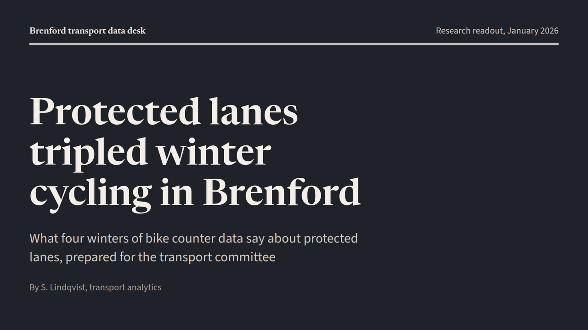](slides/TitleSlide.html)

## Summary

### KeyFindingsSlide

Key findings grouped by part, two one-line findings each. Form: text-list; mode: read.

[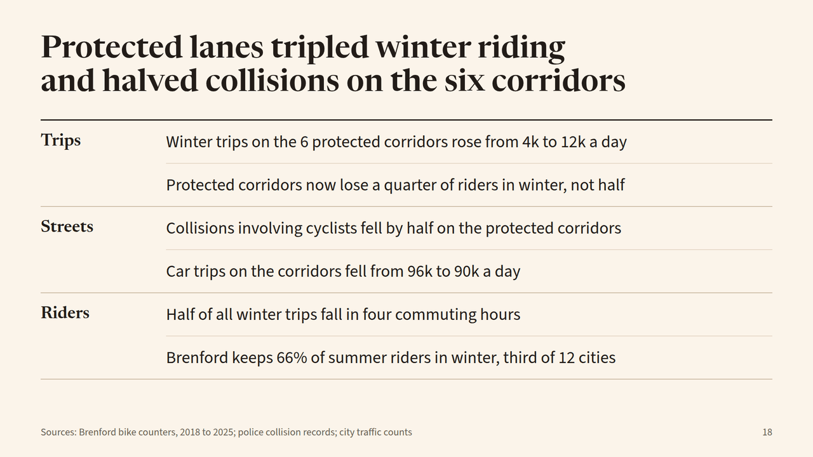](slides/KeyFindingsSlide.html)

## Section divider

### SectionDivider

Section opener with part name, headline, and standfirst. Form: statement; mode: read.

[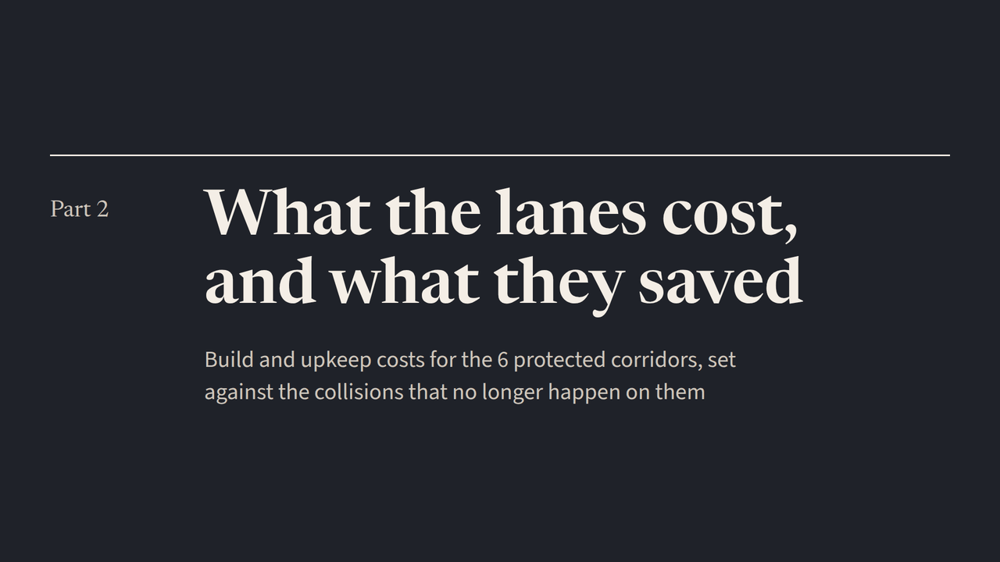](slides/SectionDivider.html)

## Body slides

### AnnotatedLineChartSlide

Two series over time with end labels, an event marker, and notes. Form: line-chart; mode: read.

[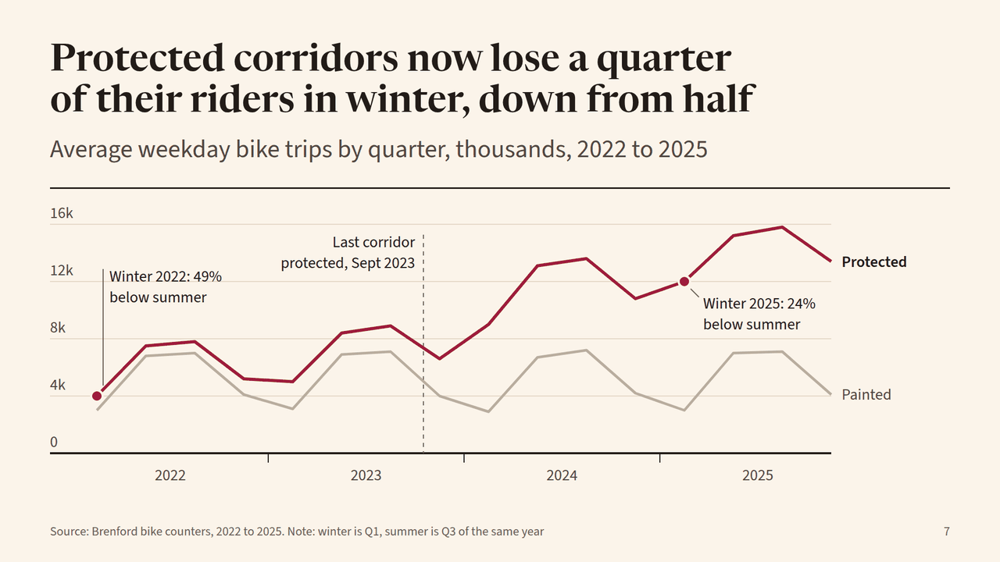](slides/AnnotatedLineChartSlide.html)

### BarChartSlide

Column chart over years with one annotation. Form: bar-chart; mode: read.

[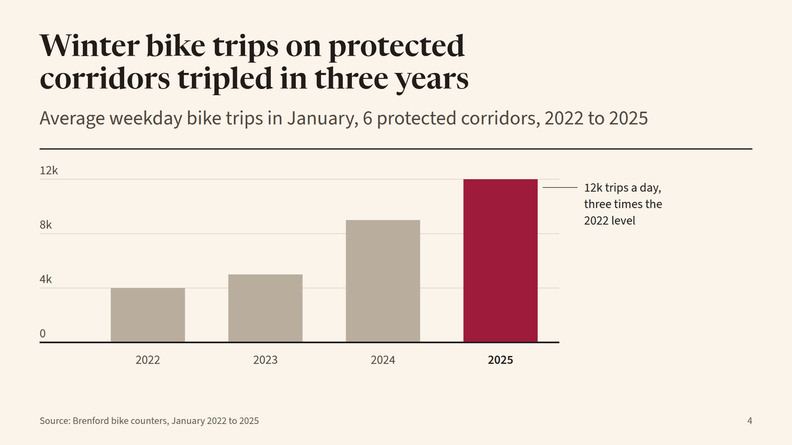](slides/BarChartSlide.html)

### ChartSidebarSlide

Finding in large text beside the column chart that proves it. Form: bar-chart,text-list; mode: read.

[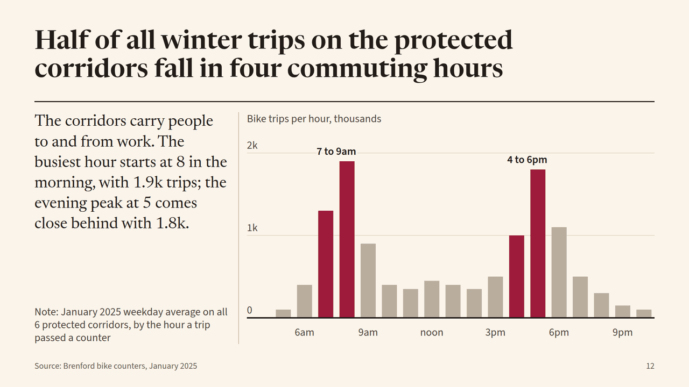](slides/ChartSidebarSlide.html)

### ColumnsSlide

Lede over three text columns on method, timing, and limits. Form: text-list; mode: read.

[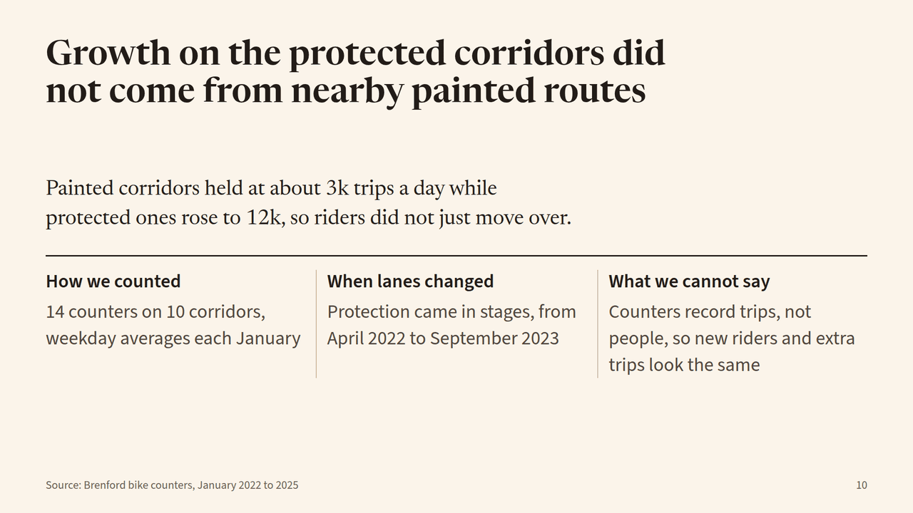](slides/ColumnsSlide.html)

### ContentSlide

Points as paragraphs with a small slope chart in the margin. Form: text-list,line-chart; mode: read.

[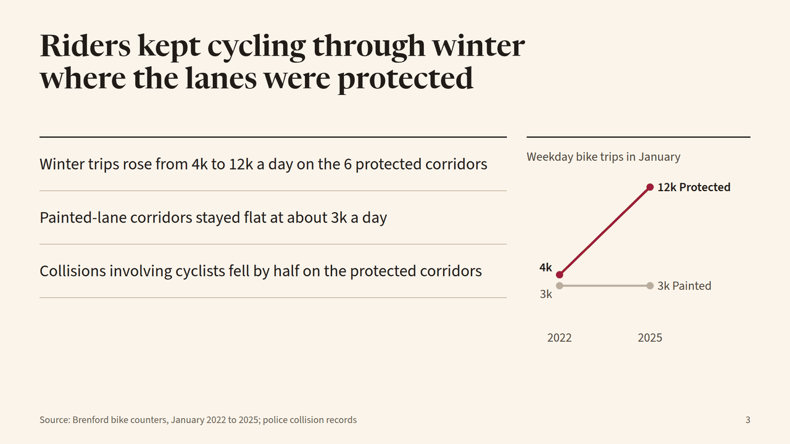](slides/ContentSlide.html)

### DivergingBarsSlide

Bars above and below a zero line, two measures moving opposite ways. Form: bar-chart; mode: read.

[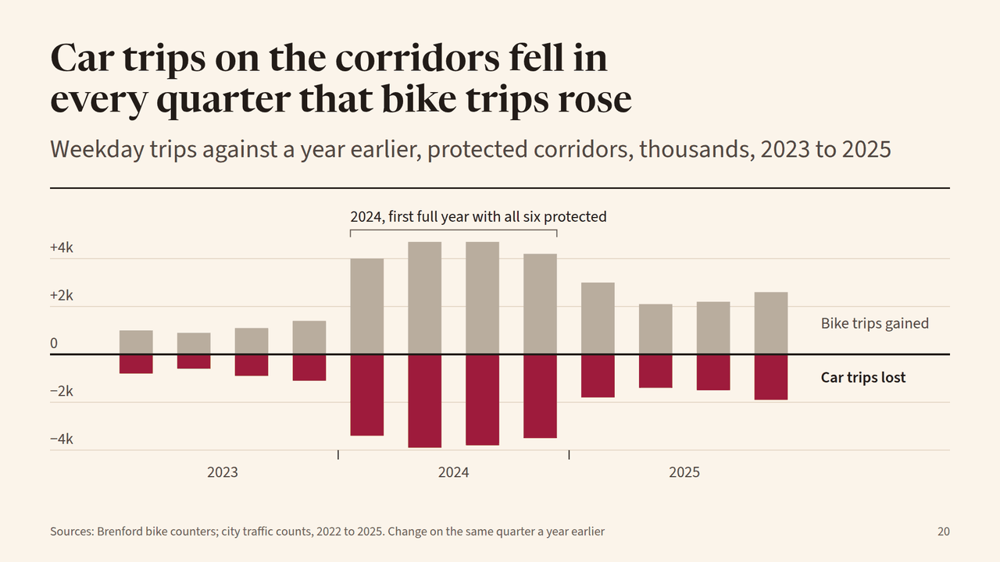](slides/DivergingBarsSlide.html)

### HighlightedGroupBarsSlide

Groups of yearly bars with the latest bar in each group highlighted. Form: bar-chart; mode: read.

[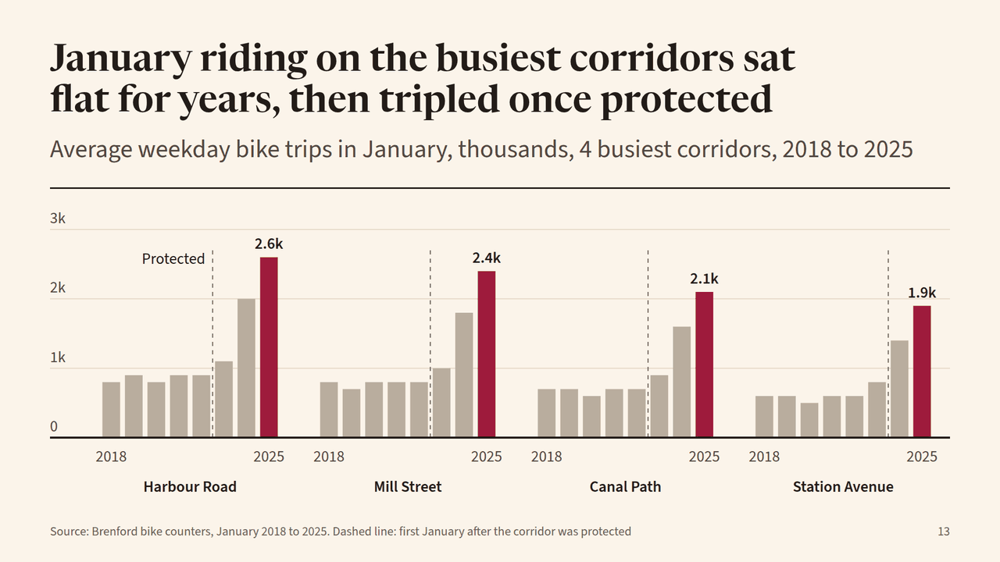](slides/HighlightedGroupBarsSlide.html)

### PredictionScorecardSlide

Table grading past forecasts right or missed against what happened. Form: table; mode: read.

[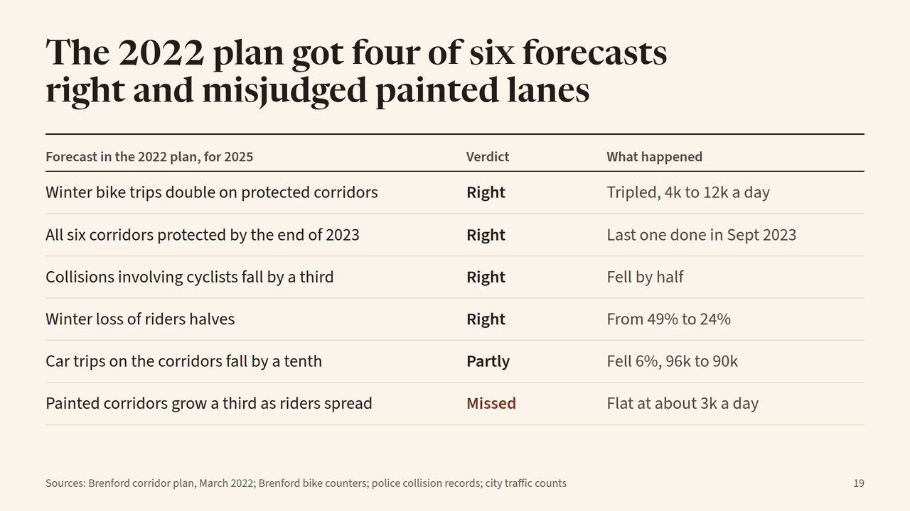](slides/PredictionScorecardSlide.html)

### PullQuoteSlide

One large quote with speaker and context. Form: quote; mode: read.

### QuotePairSlide

Two quotes side by side under a headline saying what both confirm. Form: quote; mode: read.

[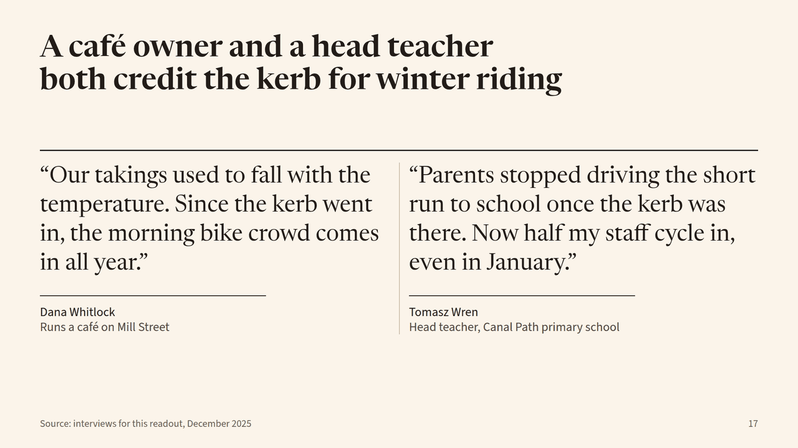](slides/QuotePairSlide.html)

### RankedBarsSlide

Twelve ranked bars with the subject highlighted. Form: bar-chart; mode: read.

[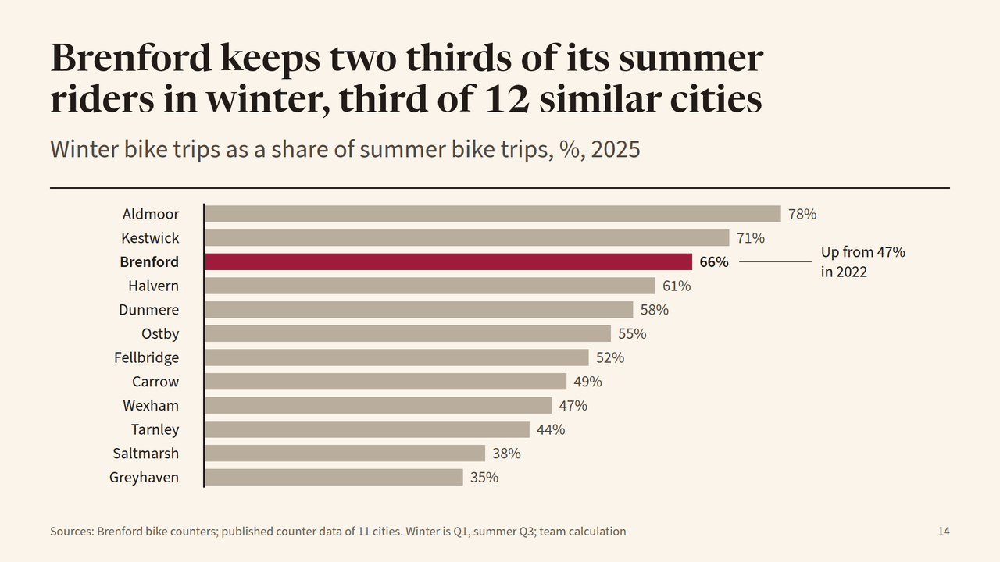](slides/RankedBarsSlide.html)

### RescaleRevealSlide

Grouped columns, then the same chart rescaled after a large group is added. Form: bar-chart; mode: presented.

[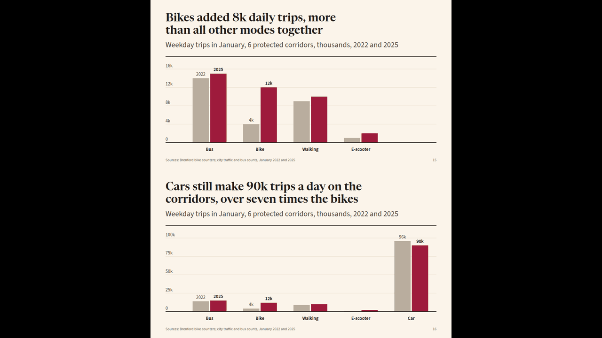](slides/RescaleRevealSlide.html)

### SmallMultiplesSlide

Six small line charts on one scale against a gray average. Form: line-chart; mode: read.

[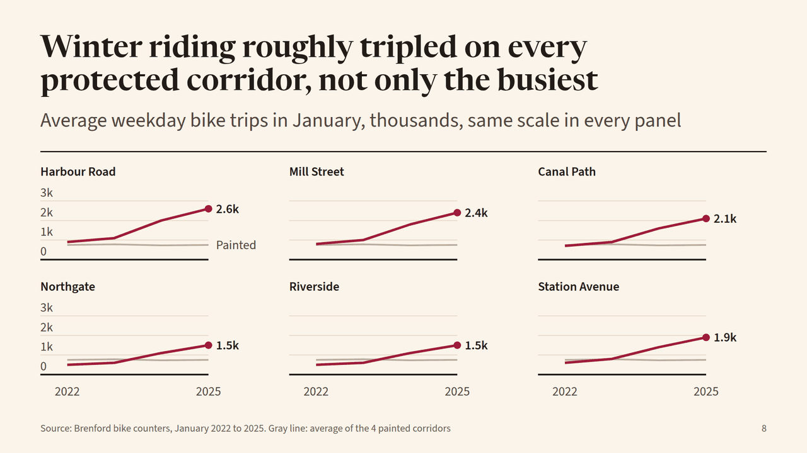](slides/SmallMultiplesSlide.html)

### StatSlide

Big figure with its sentence and a dot strip of before and after. Form: big-number,bar-chart; mode: read.

[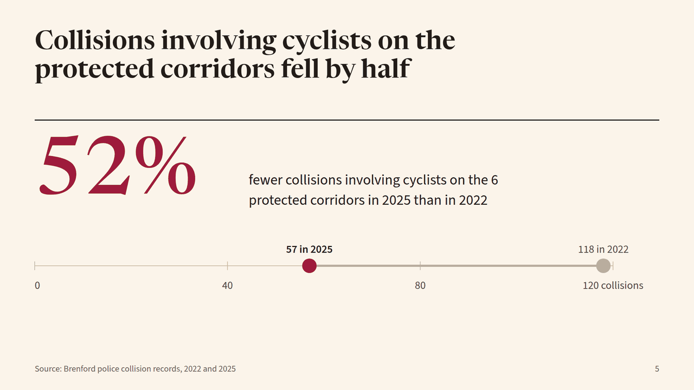](slides/StatSlide.html)

### TableSlide

Table of corridors with change figures, one row tinted. Form: table; mode: read.

[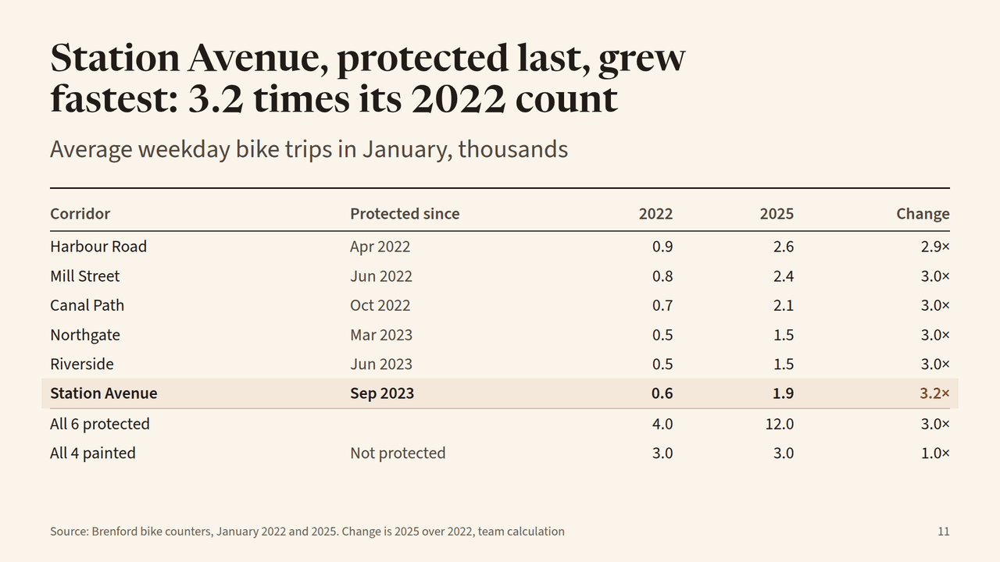](slides/TableSlide.html)

## Closing

### ClosingSlide

Closing with the decision, its consequence, and a colophon of data and contact. Form: statement; mode: read.

[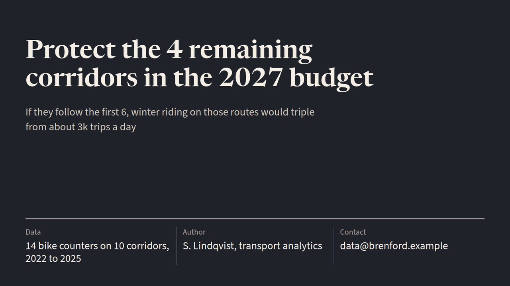](slides/ClosingSlide.html)
