# Preset showcase: keynote

Stage talks: conference keynotes, town halls, and talks in darkened rooms where the audience watches the speaker. One idea per slide, dark by default.

19 example slides, rendered at 1920x1080 and shown here at 1280x720. The HTML sources live in [`slides/`](slides/); provenance and coverage in [`manifest.md`](manifest.md). All copy is fictional placeholder content.

## Cover

### TitleSlide

Cover with talk title, speaker, and event. Form: statement; mode: presented.

[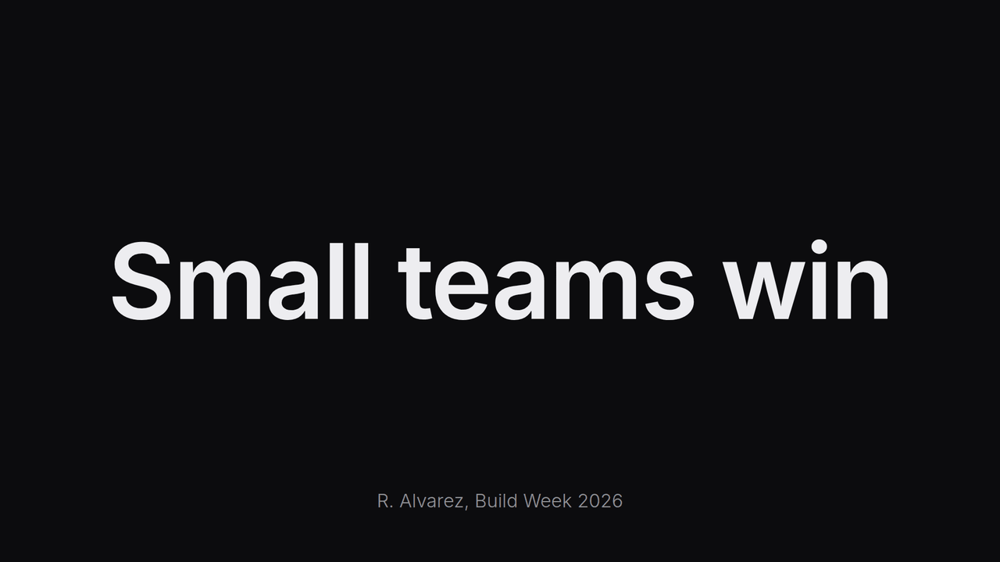](slides/TitleSlide.html)

## Section divider

### SectionDivider

Section divider with part number and part title. Form: statement; mode: presented.

[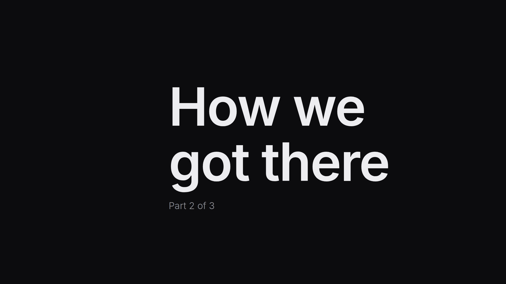](slides/SectionDivider.html)

## Body slides

### BarChartSlide

Three columns with the first highlighted. Form: bar-chart; mode: presented.

[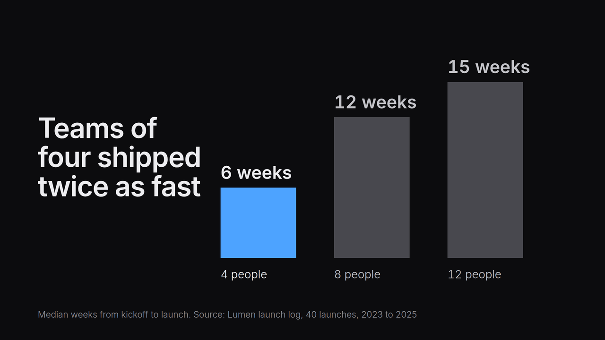](slides/BarChartSlide.html)

### BaseAndComparedSlide

One big base number, then two compared numbers built beside it. Form: number-set; mode: presented.

[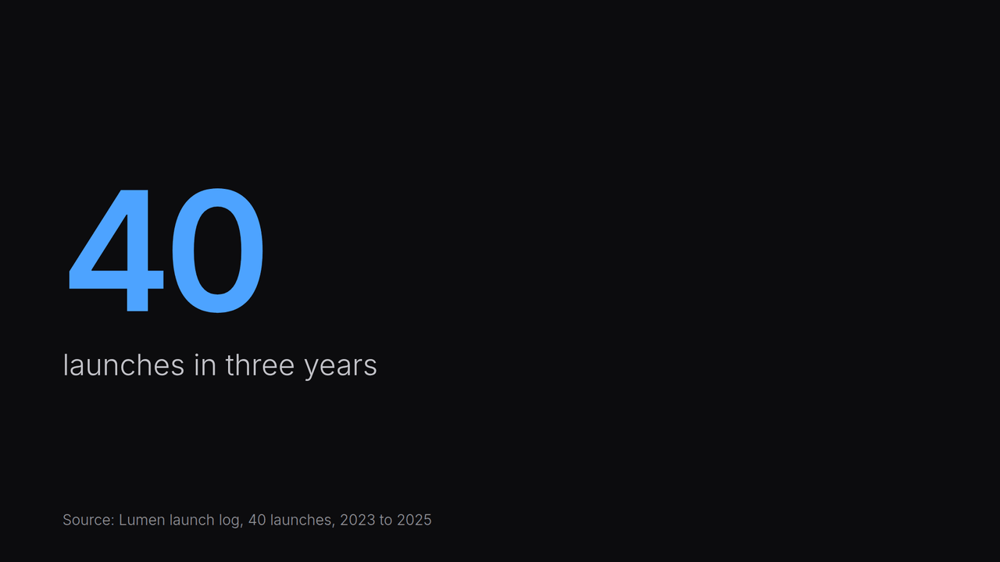](slides/BaseAndComparedSlide.html)

### BigNumberSlide

One huge figure with one line and a source. Form: big-number; mode: presented.

[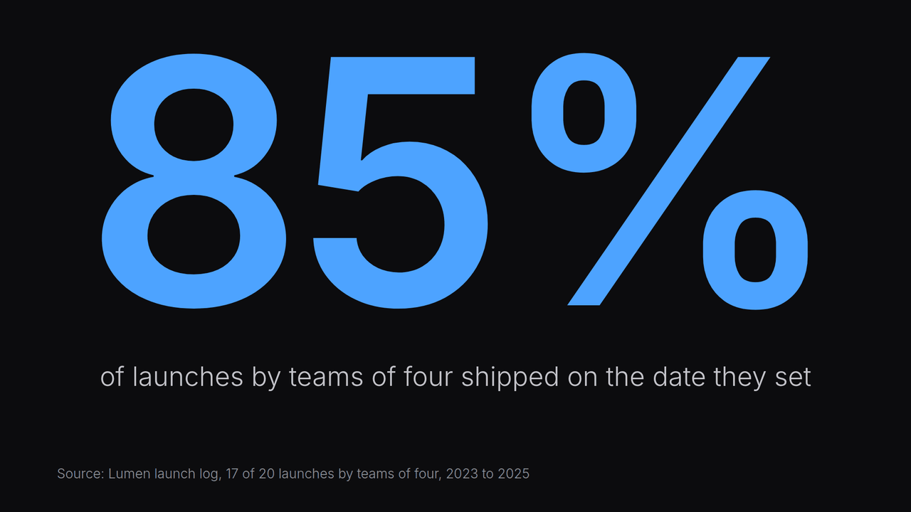](slides/BigNumberSlide.html)

### ContentSlide

Three lines built one at a time, earlier lines dimmed. Form: text-list; mode: presented.

### HighlightRegionSlide

One image with an outline moved to a new region each step. Form: image; mode: presented.

[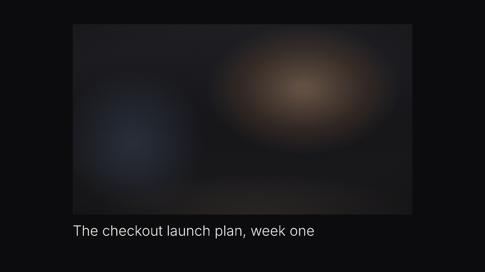](slides/HighlightRegionSlide.html)

### ImageSlide

Full-bleed photo with a short caption. Form: image; mode: presented.

### LineExitsFrameSlide

Line chart whose last segment turns accent and runs off the top. Form: line-chart; mode: presented.

[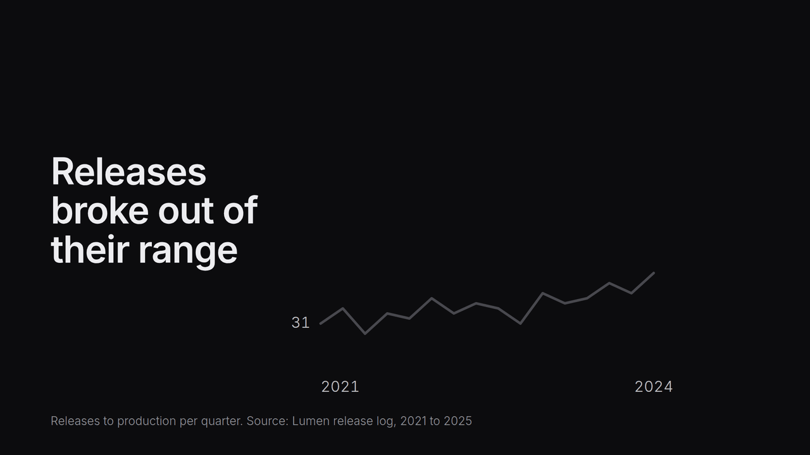](slides/LineExitsFrameSlide.html)

### PositioningDotsSlide

Axes marked by four words, rivals placed first, the answer last. Form: two-axis; mode: presented.

[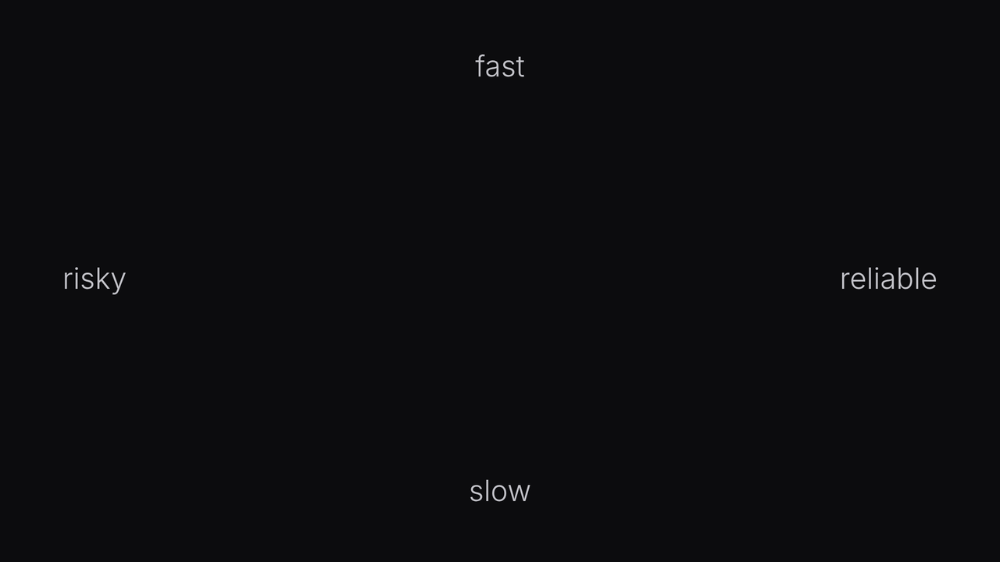](slides/PositioningDotsSlide.html)

### QuestionSlide

One question to the audience alone on the slide. Form: statement; mode: presented.

### QuoteSlide

One short quote with the speaker. Form: quote; mode: presented.

[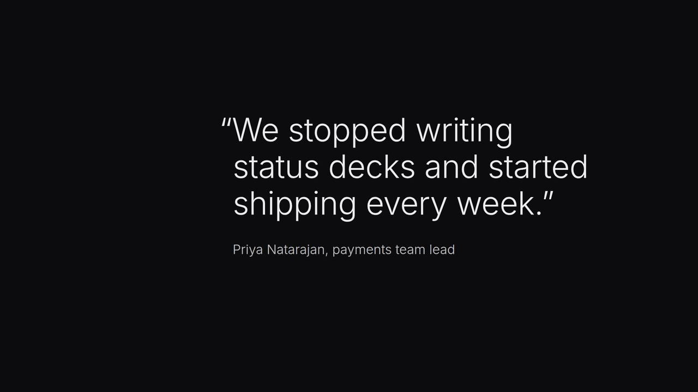](slides/QuoteSlide.html)

### ReplaceBuildSlide

Three parts shown one at a time in one place, then the whole named. Form: statement; mode: presented.

### SilhouetteCompareSlide

Two side profiles overlaid on one baseline, old then new. Form: bar-chart; mode: presented.

[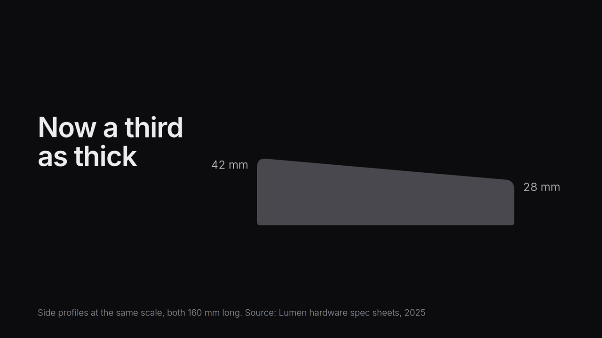](slides/SilhouetteCompareSlide.html)

### StatSlide

Two numbers on the thirds lines, before dimmed and after in accent. Form: number-set; mode: presented.

[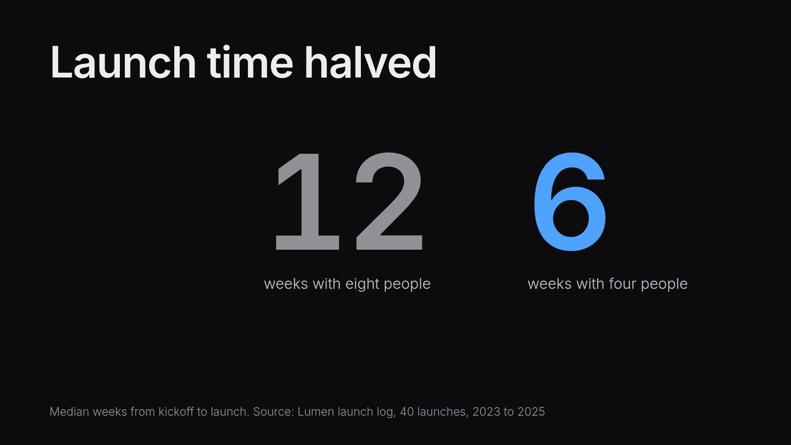](slides/StatSlide.html)

### StatementSlide

One sentence alone on the slide. Form: statement; mode: presented.

### ThirdCategorySlide

Two known things at the sides, the new category built in the middle. Form: image,statement; mode: presented.

[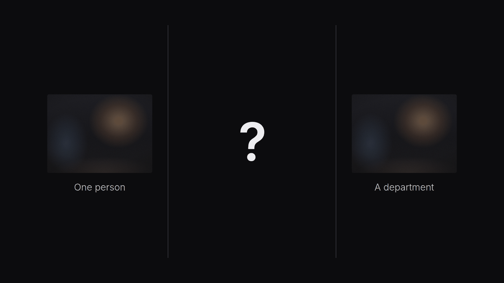](slides/ThirdCategorySlide.html)

### UnitGridSlide

Grid of 480 empty squares, then 120 of them filled. Form: unit-chart; mode: presented.

[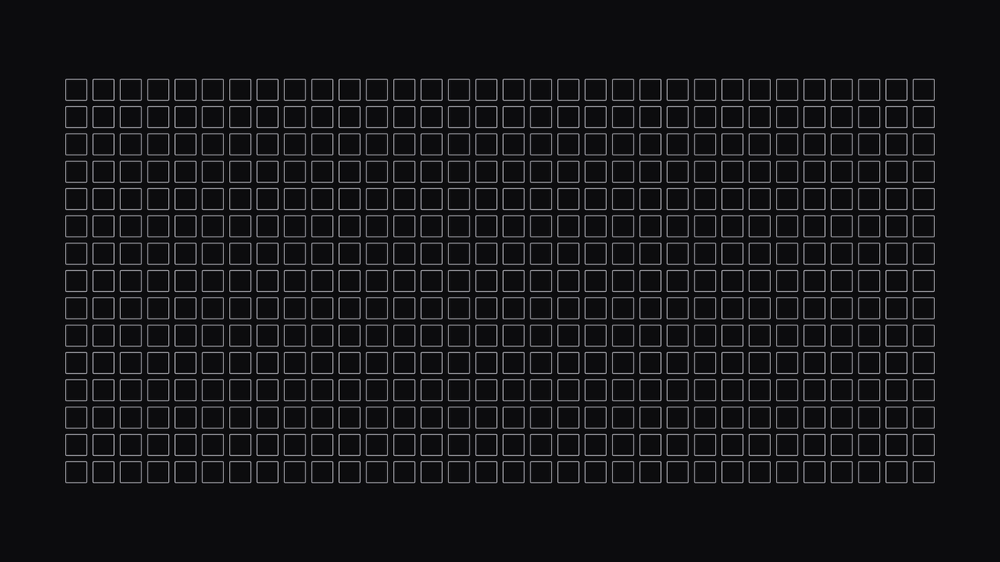](slides/UnitGridSlide.html)

## Closing

### ClosingSlide

Closing line with a link to the slides. Form: statement; mode: presented.

[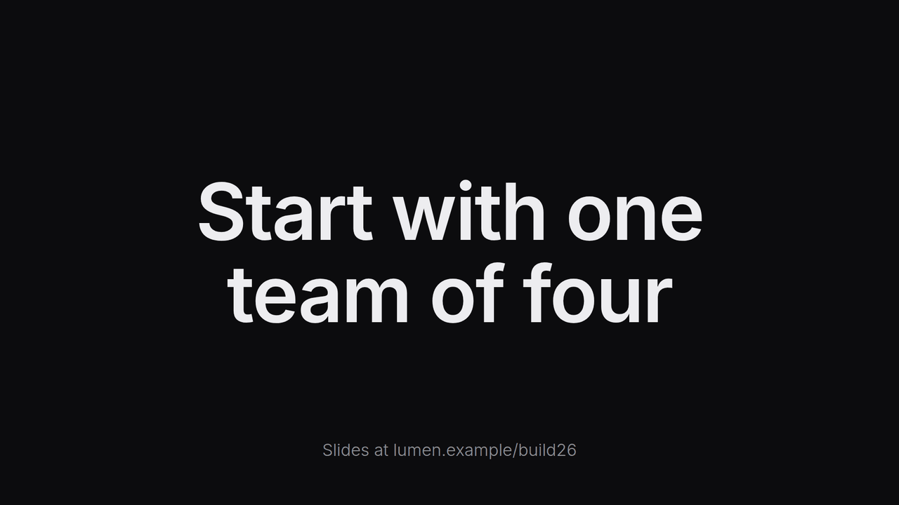](slides/ClosingSlide.html)
