# Preset showcase: product

Tech launches, product reviews, and engineering all-hands. Short declaratives about what the product does, with the number.

19 example slides, rendered at 1920x1080 and shown here at 1280x720. The HTML sources live in [`slides/`](slides/); provenance and coverage in [`manifest.md`](manifest.md). All copy is fictional placeholder content.

## Cover

### TitleSlide

Cover with product name and tagline. Form: statement; mode: presented.

[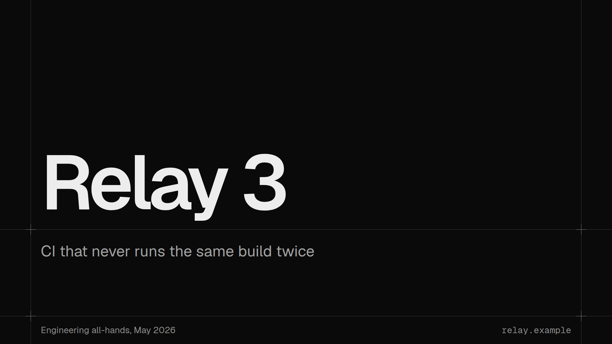](slides/TitleSlide.html)

## Summary

### BentoFeatureSlide

Launch recap as ruled cells around a hero panel, sized by importance. Form: number-set,image; mode: presented.

[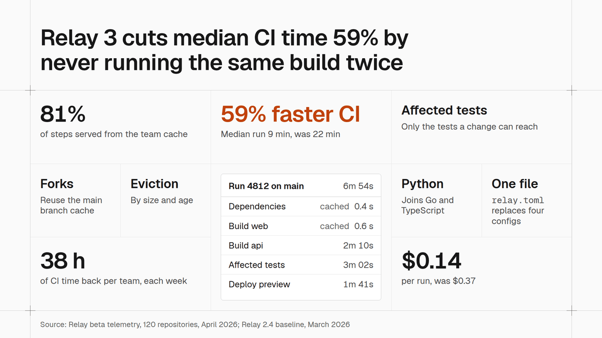](slides/BentoFeatureSlide.html)

## Section divider

### SectionDivider

Section title with the deck's parts as a ruled tracker. Form: text-list; mode: presented.

[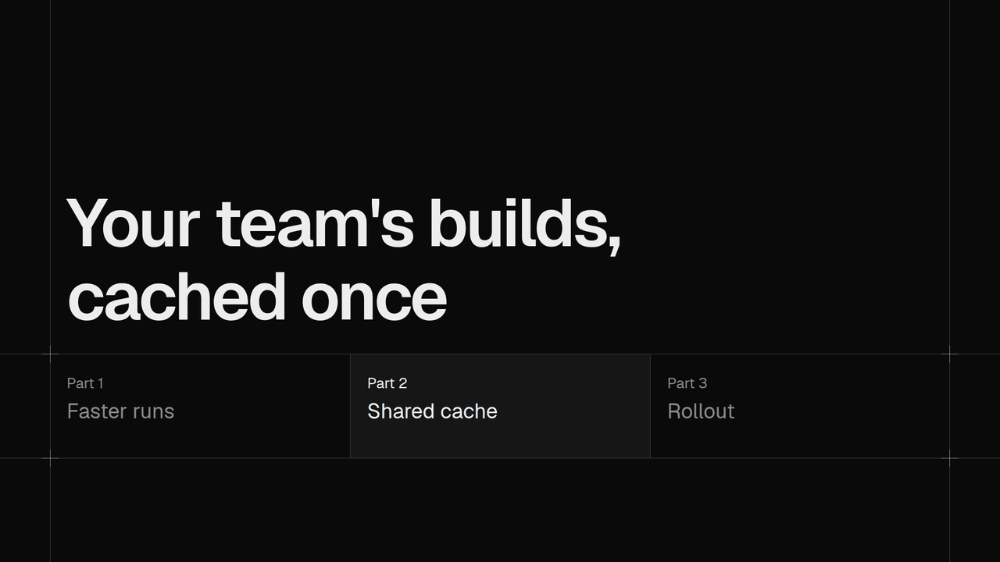](slides/SectionDivider.html)

## Body slides

### BarChartSlide

Columns over releases in a panel with a drop bracket. Form: bar-chart; mode: presented.

[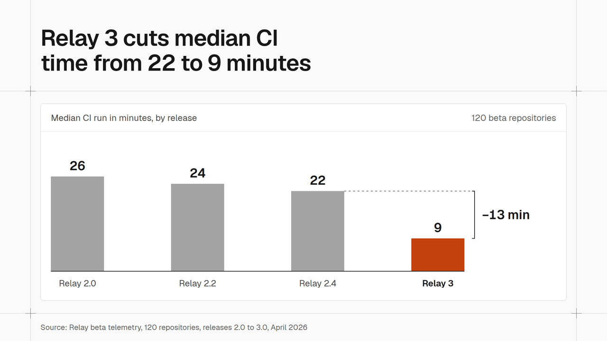](slides/BarChartSlide.html)

### BeforeAfterSlide

Old and new pipelines step by step on one duration scale. Form: part-chart; mode: presented.

[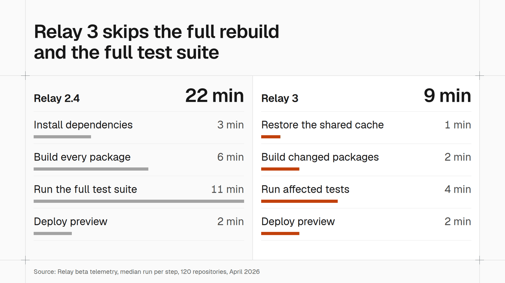](slides/BeforeAfterSlide.html)

### BenchmarkTableSlide

Table of named tests against rivals, own column lifted and highlighted. Form: table; mode: read.

[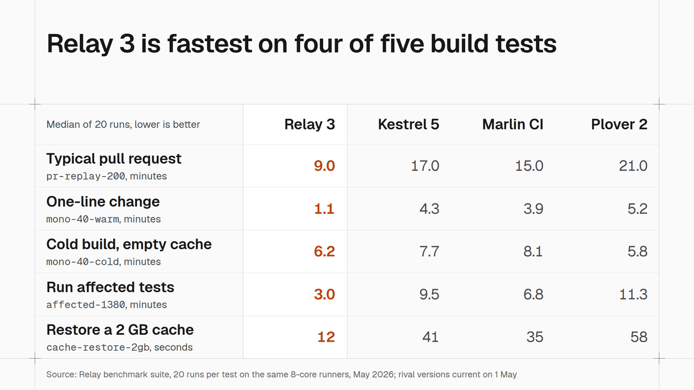](slides/BenchmarkTableSlide.html)

### ChangelogSlide

Dated release rows with version numbers. Form: timeline; mode: read.

[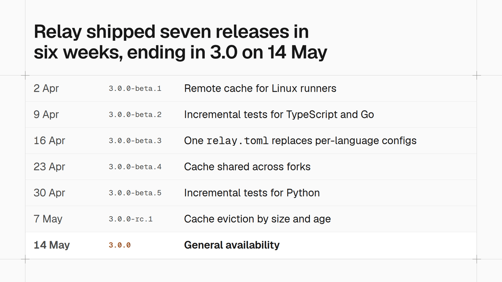](slides/ChangelogSlide.html)

### ContentSlide

Three spec rows: feature, what it does, and its number. Form: table; mode: presented.

[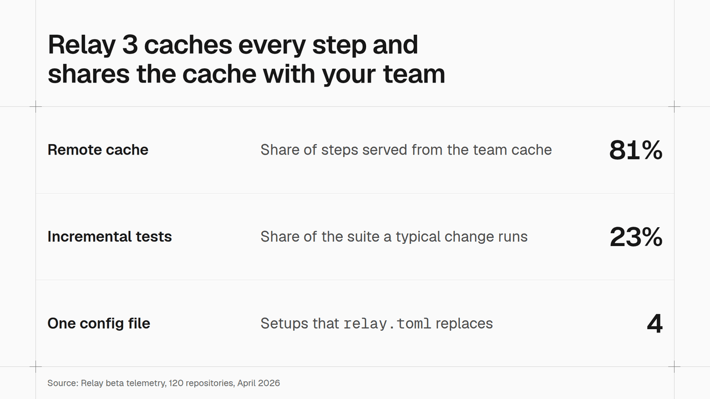](slides/ContentSlide.html)

### EfficiencyCurveSlide

Two curves on unnumbered axes, only the new release in color. Form: line-chart; mode: presented.

[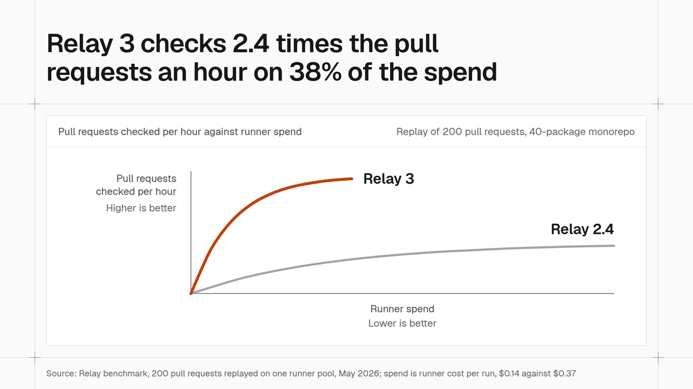](slides/EfficiencyCurveSlide.html)

### GuidanceSlide

Quarter and full-year expectations as two columns of ranges. Form: number-set; mode: read.

[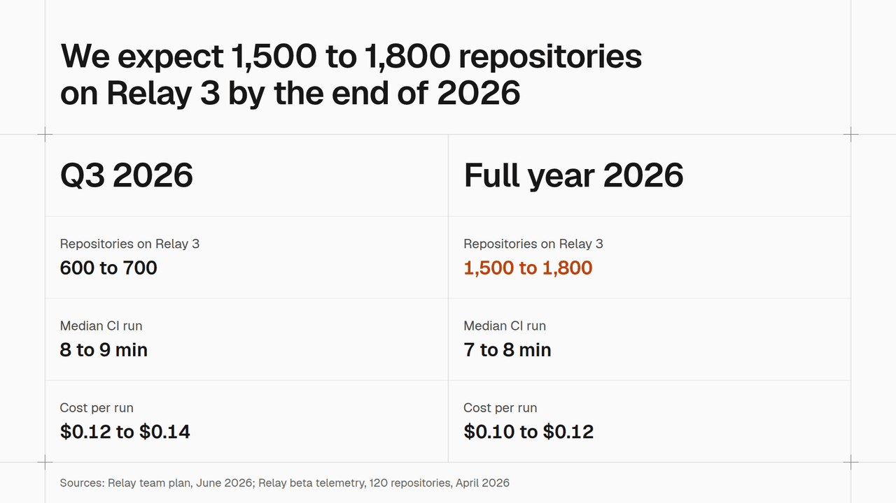](slides/GuidanceSlide.html)

### MetricsRowSlide

One lead metric and three supporting metrics, each with its old value. Form: number-set; mode: presented.

[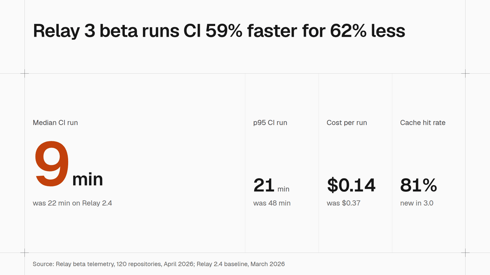](slides/MetricsRowSlide.html)

### NorthStarTreeSlide

Four input metrics joined by a bracket to the one north star metric. Form: diagram; mode: presented.

[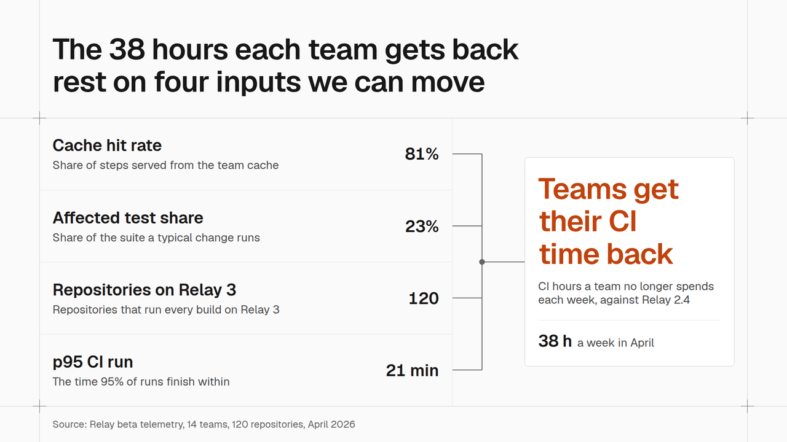](slides/NorthStarTreeSlide.html)

### RoadmapSlide

Roadmap in now, next, and later columns. Form: timeline; mode: presented.

[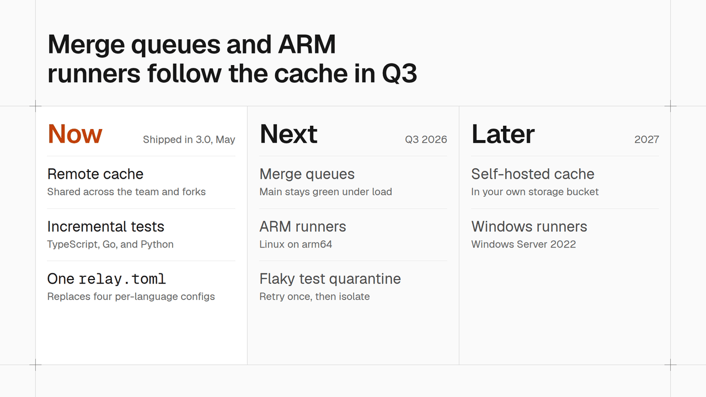](slides/RoadmapSlide.html)

### ScreenshotSlide

UI screenshot bleeding off the edge with callouts. Form: image; mode: presented.

[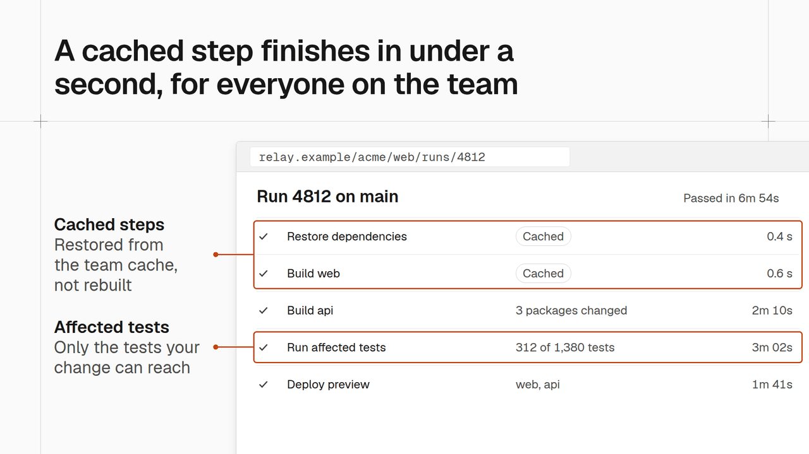](slides/ScreenshotSlide.html)

### SixTwelveSlide

Six weeks and twelve months of one metric against last year and target. Form: line-chart,number-set; mode: read.

[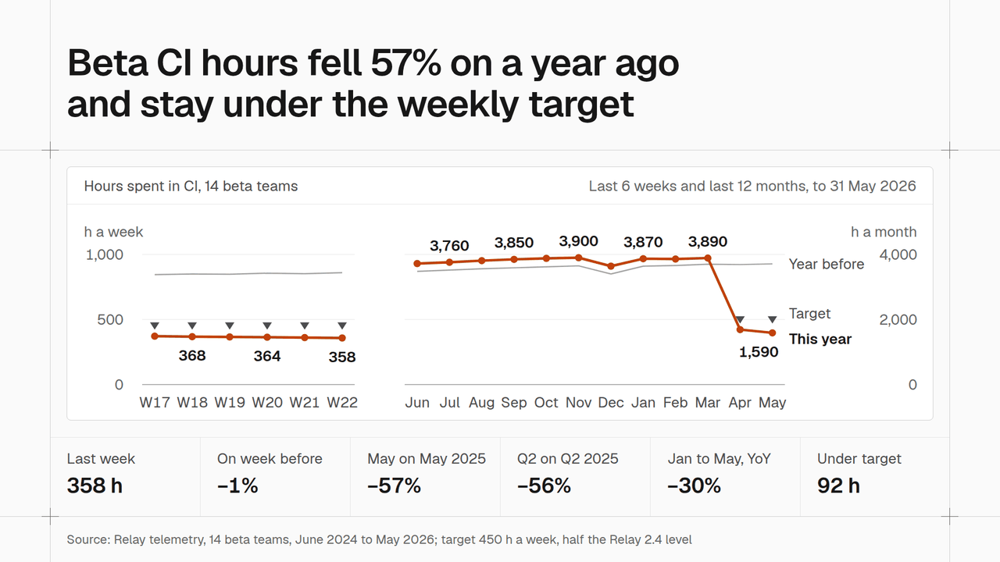](slides/SixTwelveSlide.html)

### StatSlide

One big number over a stacked strip showing where it comes from. Form: big-number,part-chart; mode: presented.

[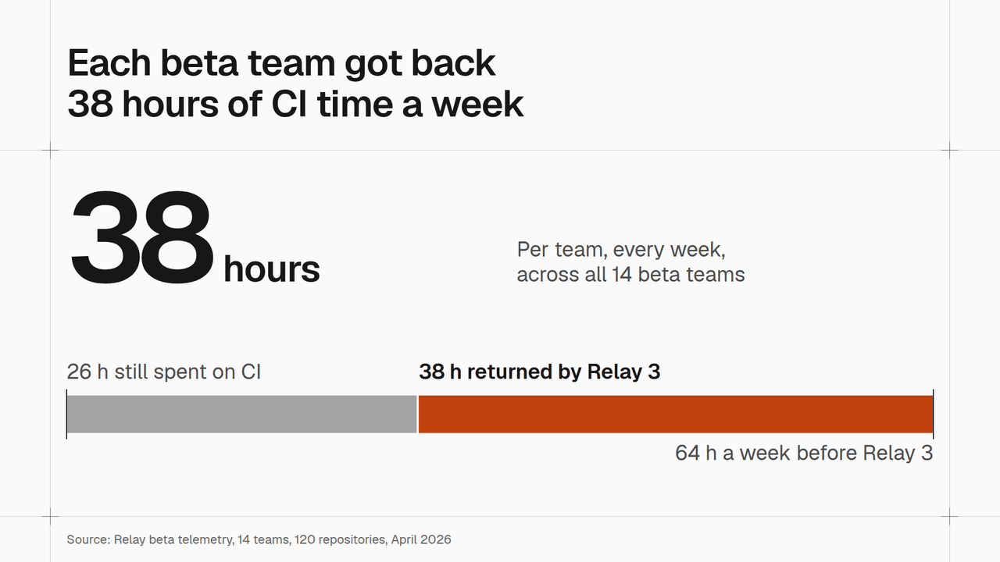](slides/StatSlide.html)

### ThresholdTrendSlide

Survey score line crossing a dashed target bar, values labelled. Form: line-chart; mode: presented.

[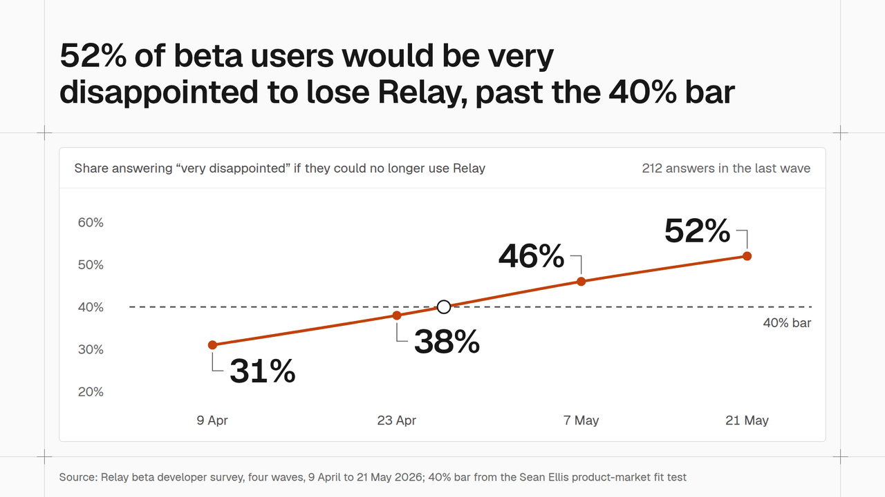](slides/ThresholdTrendSlide.html)

### UnitTallySlide

Headline count, then two subsets as numbers and one dot per unit. Form: unit-chart,big-number; mode: presented.

[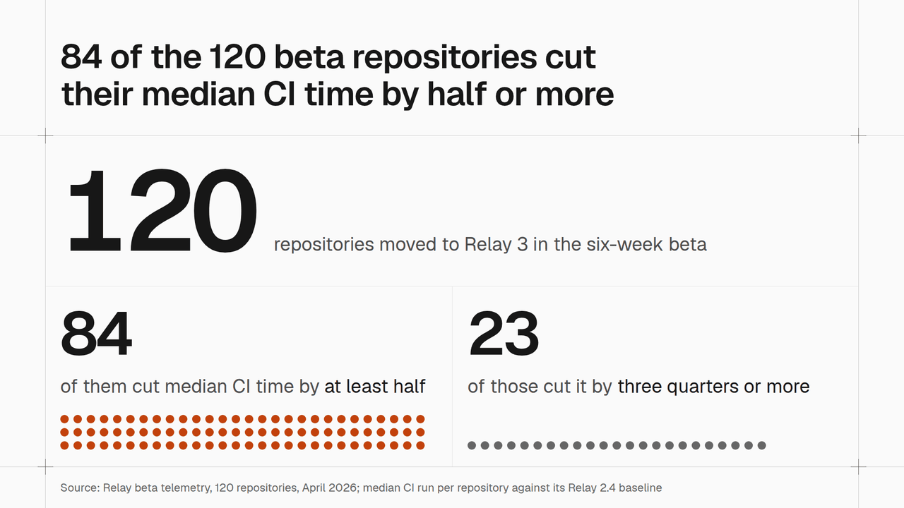](slides/UnitTallySlide.html)

## Closing

### ClosingSlide

The ask with a terminal command panel and next steps. Form: code,text-list; mode: presented.

